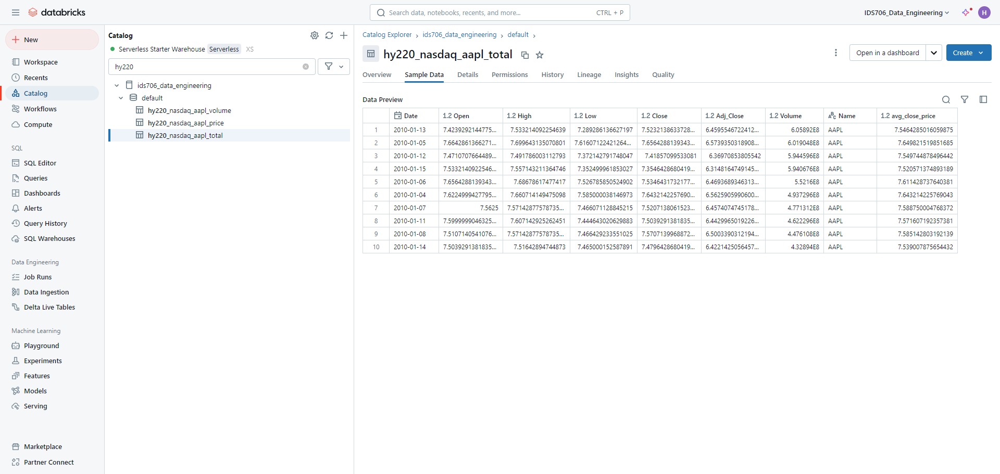

# IDS-706 Data Engineering: Project 7
This is a IDS-706 week 7 project that tries to explore Package a Python Script into a Command-Line Tool and a Complex SQL Query.

- Package a Python script with setuptools or a similar tool

- Include a user guide on how to install and use the tool

- Include communication with an external database: Databricks

## User Guide

### Prerequisites
Ensure that you have Python 3 installed on your machine. You can download it from [Python's official website](https://www.python.org/downloads/).

### Installation with `setup.py`
To install the package locally, follow these steps:

1. Clone the repository:
   \```bash
   git clone https://github.com/haobo-yuan/IDS706-7-PyPackage.git
   cd IDS706-7-PyPackage
   \```

2. Install the package using `setup.py`:
   \```bash
   pip install .
   \```

3. Once installed, you can run the command-line tool using:
   \```bash
   run_main
   \```

### Packaging and Testing
If you want to create the distribution files and test them on your machine:

1. **Build the package**:
   \```bash
   python setup.py sdist bdist_wheel
   \```

   This will create a `dist` folder containing the `.whl` and `.tar.gz` files.

2. **Install the package locally from the built `.whl` file**:
   \```bash
   pip install dist/IDS706_7_PyPackage-0.1-py3-none-any.whl
   \```

3. **Test the command**:
   After installation, run:
   \```bash
   run_main
   \```

### Direct Download and Installation of the `.whl` File
If you have downloaded the `.whl` file directly, follow these steps to install and use it:

1. **Download the `.whl` file**: [IDS706_7_PyPackage-0.1-py3-none-any.whl](https://github.com/haobo-yuan/IDS706-7-PyPackage/releases/download/v0.1/IDS706_7_PyPackage-0.1-py3-none-any.whl)

2. **Install the downloaded `.whl` file**:
   \```bash
   pip install IDS706_7_PyPackage-0.1-py3-none-any.whl
   \```

3. **Run the command**:
   \```bash
   run_main
   \```

### Notes
- Make sure you have all dependencies installed as mentioned in the `setup.py`.
- For development purposes, you can modify the code and rebuild the package as needed.

---

**Below is historical information about the project.**

---

## Project Description

Here is a brief overview roadmap of the project 


Here is a demo video show you a detailed explanation of this roadmap.

[](https://youtu.be/tp5cN8F3yIM)

Here is the final Databricks table for this project.



## AAPL Price Statistics (2010-2021)


The data is from the everyday close price of <NASDAQ 100 Data From 2010> dataset on Kaggle.
>https://www.kaggle.com/datasets/kalilurrahman/nasdaq100-stock-price-data/data 

The statistics are as follows:
|   Year |      mean |    median |       std |
|-------:|----------:|----------:|----------:|
|   2010 |   9.28009 |   9.18089 |  1.3413   |
|   2011 |  13.0002  |  12.7509  |  0.925852 |
|   2012 |  20.5732  |  20.8032  |  2.39203  |
|   2013 |  16.8798  |  16.467   |  1.60314  |
|   2014 |  23.0662  |  23.475   |  3.34282  |
|   2015 |  30.01    |  30.075   |  1.92089  |
|   2016 |  26.151   |  26.4375  |  1.91019  |
|   2017 |  37.6378  |  38.185   |  3.6553   |
|   2018 |  47.2634  |  46.5125  |  5.14847  |
|   2019 |  52.064   |  50.7537  |  8.63474  |
|   2020 |  95.3471  |  91.6325  | 21.8098   |
|   2021 | 134.344   | 132.42    |  9.86899  |


## Description and Conclusion:
Apple Inc.'s stock performance from 2010 to 2021 shows significant growth, with the average
price rising from $9.28 to $134.34. The company saw consistent increases in stock value, 
particularly in 2020 and 2021, likely driven by strong demand for electronics during the pandemic
and its market leadership in innovation. While volatility increased in the later years, especially
in 2020 with the standard deviation peaking at 21.81, Apple's overall performance was robust,
reflecting its resilience and growth in the global tech industry.
